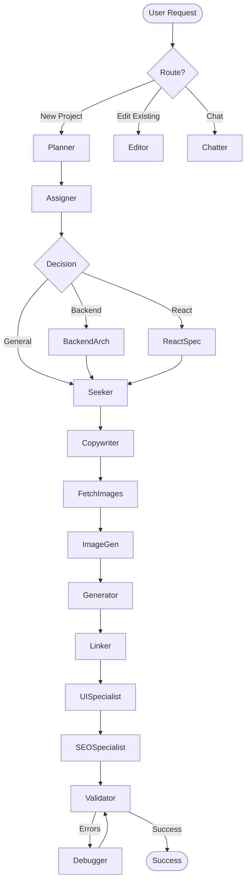

# How Vibe-LangGraph Works

Vibe-LangGraph is a high-fidelity agentic coding platform that orchestrates **17 specialized AI agents** to autonomously build, polish, and validate projects. It uses a graph-based architecture powered by **LangGraph** and **Gemini 2.0 Flash**.

## Core Architecture

The system is built on a **State Graph** (`CodebaseState`) that passes context (files, tokens, reasoning, and diagnostic reports) between agents.

## The 17 specialized Agents

| Agent | Module | Mission & Functionality |
| :--- | :--- | :--- |
| **Router (LLM)** | `agents/router` | **The Gatekeeper**. Analyzes user intent to branch the workflow. It detects if a request is a "New Project", an "Update/Edit", or a "Chat" and sets the `current_step` accordingly. |
| **Planner** | `agents/planner` | **The Architect**. Translates vague intents into a concrete technical specification. It defines the file structure, design tokens, and architectural patterns (e.g., Bento Grid, Glassmorphism). |
| **Assigner** | `agents/assigner` | **The Orchestrator**. Analyzes the Plan and decides which specialized developers are needed. It dispatches work to the Backend Architect or React Specialist based on complexity. |
| **Seeker** | `agents/seeker` | **The Researcher**. Performs a deep dive into the user's industry/niche to find relevant trends, terminology, and content ideas, enriching the `reasoning` state. |
| **Copywriter** | `agents/copywriter` | **The Voice**. Generates premium, conversion-focused text. It ensures the brand tone is consistent across all headers, CTAs, and body text. |
| **Image Generator** | `agents/image_generator` | **The Visualist**. Translates simple image requests into cinematic, high-fidelity AI prompts optimized for visual consistency with the design tokens. |
| **Fetch Images** | `agents/fetch_images` | **The Sourcing Specialist**. Fulfills image requests by searching high-quality asset libraries (Unsplash/LoremFlickr) to find and download real visual assets into the project hub. |
| **Generator** | `agents/generator` | **The Lead Developer**. The primary engine for code creation. It implements the files defined in the Plan, meticulously following the established design tokens. |
| **React Specialist** | `agents/react_specialist` | **The Frontend Expert**. Specialized in high-end React/Next.js architectures. It creates modular, type-safe components and manages complex frontend state. |
| **Backend Architect**| `agents/backend_architect`| **The Systems Engineer**. Focused on the data layer. It designs REST/GraphQL APIs, database schemas, and server-side logic (Node.js/Python). |
| **UI Specialist** | `agents/ui_specialist` | **The Polisher**. Steps in after initial generation to add "Vibe". Focuses on micro-animations, glassmorphism upgrades, and premium Tailwind styling. |
| **Linker** | `agents/linker` | **The Integrity Checker**. Ensures every file is correctly connected. It fixes broken imports, validates asset paths, and ensures the project builds without errors. |
| **SEO Specialist** | `agents/seo_specialist` | **The Growth Hacker**. Audits the generated code for Core Web Vitals, metadata completeness, and search engine visibility. |
| **Validator** | `agents/validator` | **The Auditor**. The final checkpoint. It performs a multi-dimensional quality audit. If it finds issues, it triggers the "Self-Healing Loop". |
| **Debugger** | `agents/debugger` | **The Fixer**. Triggered by a failed validation. It performs root-cause analysis on the `diagnostic_report` and applies surgical patches to fix errors. |
| **Editor** | `agents/editor` | **The Surgeon**. Handles incremental updates or changes requested by the user. It applies minimal diffs to existing code to preserve formatting and logic. |
| **Chatter** | `agents/chatter` | **The Liaison**. Handles direct interaction with the user for questions, explanations, or simple conversational tasks that don't require code changes. |

## The Workflow Graph

The orchestration is defined in `graph/workflow.py`:

## Specialized Functionalities

### 1. High-Fidelity React/Next.js
When the **Assigner** detects a need for modern frontend architecture, it routes the workflow to the **React Specialist**. 
- **Atomic Components**: Instead of monolithic HTML, the system generates reusable `.tsx` components.
- **Tailwind Config**: The system dynamically updates `tailwind.config.js` to match the project's unique `design_tokens`.

### 2. Full-Stack Backend Integration
For projects requiring data persistence or custom logic, the **Backend Architect** is triggered.
- **RESTful APIs**: Generates Python (FastAPI) or Node.js endpoints.
- **Schema Modeling**: Automatically designs SQL/NoSQL schemas and provides an `API.md` for integration.

### 3. "Premium Vibe" Polishing
The **UI Specialist** and **Copywriter** work in tandem to ensure the project doesn't just "work" but feels "premium".
- **Glassmorphism**: Automatic application of backdrop-blur and border-opacity.
- **Micro-interactions**: Addition of hover scales, fade-in-up animations, and smooth transitions.

## State Management

The `CodebaseState` tracks:
- `files`: Full contents and metadata of every project file.
- `plan`: The technical strategy shared across all agents.
- `design_tokens`: Visual variables (colors, spacing) to ensure UI consistency.
- `token_usage`: Granular tracking of AI costs per agent.
