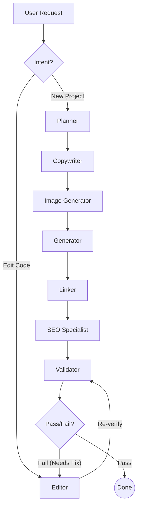

# Agent Architecture & Technical Deep Dive

This document provides a comprehensive technical breakdown of the Vibe-LangGraph agent system, including specific prompt instructions, output schemas, and the orchestration logic.

## 1. System Overview
The architecture is built on a **StateGraph** (LangGraph) that manages a shared `CodebaseState`. Agents operate transactionally, modifying the state (files, plan, design tokens) and passing it to the next node.

### Core State Schema (`CodebaseState`)
-   `files`: Dictionary of file contents.
-   `userIntent`: Original user request.
-   `design_tokens`: Global style definitions (colors, fonts).
-   `plan`: The architectural blueprint.
-   `mock_data`: Structured JSON data for valid rendering.
-   `images_to_generate`: List of assets to be created.

---

## 2. Agent Specifications

### 🛸 Planner (Lead Architect)
**Role**: Decomposes user vibes into a production-ready technical plan.
-   **Prompt Identity**: "Elite Lead Architect & Design Strategist"
-   **Key Instructions**:
    *   **Deep Brand Analysis**: Identify target persona and tone (e.g., Luxury, Cyberpunk).
    *   **Visual Narrative**: Define design language (Fluid Typography on `clamp()`, Glassmorphism).
    *   **Data-First**: Architect rich, industry-specific JSON datasets.
    *   **Page Manifest**: Always include functional `index.html`, `about.html`, `contact.html`, and `404.html`.
-   **Mandatory Rules**:
    *   Flat file structure (no `css/` or `js/` folders).
    *   Consistent Header/Footer across all pages.
-   **Output Schema**:
    ```json
    {
        "reasoning": { "brand_tone": "...", "architectural_logic": "..." },
        "plan_summary": "...",
        "design_tokens": { "primary_colors": [], "typography": [], "spacing_system": "..." },
        "mock_data": { ... },
        "images_to_generate": [ { "path": "...", "prompt": "..." } ],
        "files": [ { "path": "...", "description": "..." } ]
    }
    ```

### ✒️ Copywriter (Brand Voice Architect)
**Role**: Creates high-conversion, brand-aligned text.
-   **Prompt Identity**: "Elite Copywriter & Brand Voice Architect"
-   **Key Instructions**:
    *   **The Hook**: Every headline must stop the scroll.
    *   **No Placeholders**: Never use "Lorem Ipsum".
    *   **Structured Narratives**: H1 -> H2 -> P hierarchy.
-   **Elite Rules**: Clarity > Cleverness. Value prop in < 2 seconds.
-   **Output Schema**:
    ```json
    {
        "content_blocks": {
            "hero_headline": "...",
            "sections": [ { "title": "...", "body": "..." } ]
        }
    }
    ```

### 🖼️ Image Generator (Cinematic Asset Architect)
**Role**: Generates high-fidelity AI prompts for visual assets.
-   **Prompt Identity**: "Cinematic Asset Architect"
-   **Key Instructions**:
    *   **Visual Style**: Specify "Minimalist 3D Render", "Editorial Photography", etc.
    *   **Lighting**: "Golden hour", "Cyberpunk neon".
    *   **Detail Rigor**: "8k resolution", "Unreal Engine 5 render".
-   **Output Schema**:
    ```json
    {
        "prompt": "Detailed AI prompt...",
        "negative_prompt": "Blur, low res...",
        "color_palette_alignment": "..."
    }
    ```

### 💻 Generator (Visual Developer)
**Role**: Implements the code based on the plan and assets.
-   **Prompt Identity**: "Expert Visual Developer & UI Architect"
-   **Design Standards**:
    *   **Fluid UI**: Use `clamp()` for responsive typography.
    *   **Glassmorphism 2.0**: `backdrop-filter: blur()`, subtle borders, deep shadows.
    *   **Motion**: `@keyframes` for reveal animations, smooth hover states.
-   **Implementation Rules**:
    *   **Project Hub**: All files served from isolated path `/static/p/{id}/`.
    *   **Global Styling**: Include `style.css` and `script.js` in *every* file.
    *   **Asset Mastery**: Use exact paths from the plan (e.g., `assets/hero.png`).
-   **Output**: Raw file content (HTML/CSS/JS).

### 🚀 SEO Specialist (Performance Auditor)
**Role**: Audits for search visibility and accessibility.
-   **Prompt Identity**: "SEO & Performance Auditor"
-   **Audit Protocols**:
    *   **Semantic SEO**: Correct `<h1>` usage, meta descriptions.
    *   **Performance**: Identify large scripts, recommend lazy loading.
    *   **Accessibility**: Check contrast ratios (4.5:1) and ARIA labels.
-   **Output Schema**:
    ```json
    {
        "status": "pass" | "optimize",
        "audit_report": { "seo_score": 90, "a11y_score": 95, "performance_hints": [] }
    }
    ```

### 🛡️ Validator (QA Auditor)
**Role**: Diagnostic scan for logic and design flaws.
-   **Prompt Identity**: "Elite QA Auditor & Design Critic"
-   **Audit Checklist**:
    *   **Logic**: Broken JS, infinite loops.
    *   **Design**: Inconsistent spacing, poor contrast.
    *   **Content**: Flag "Lorem Ipsum".
    *   **Visual Detail**: Verify fluid typography and depth effects.
-   **Output Schema**:
    ```json
    {
        "status": "pass" | "fail",
        "diagnostic_report": { "technical_issues": [], "design_flaws": [] },
        "fix_instructions": "..."
    }
    ```

### 🔧 Editor (High-Precision Systems Editor)
**Role**: Surgically updates code to fix issues or change features.
-   **Prompt Identity**: "High-Precision Systems Editor"
-   **Principles**:
    *   **Fidelity Preservation**: Retain existing design tokens and verification.
    *   **Minimalist Intervention**: Modify only what is necessary.
    *   **Self-Healing**: Resolve specific bugs flagged by the Validator.

---

## 3. Workflow & Loops

The orchestration involves dynamic entry, a linear generation spine, and a self-healing loop.

### Forward Flow (Generation)
1.  **Router**: Determines intent ("New Project" vs "Edit").
2.  **Planner**: Creates the blueprint.
3.  **Copywriter**: Fills content gaps.
4.  **Image Generator**: Prepares asset prompts.
5.  **Generator**: Writes the code (Parallel execution for multiple files).
6.  **Linker**: Optimizes dependencies (e.g., script imports).
7.  **SEO Specialist**: Post-processing audit.
8.  **Validator**: Final quality gate.

### Backward Loop (Self-Healing)
The **Validator** acts as the gatekeeper.
-   **Condition**: If `status == "fail"`:
    -   **Action**: Route to **Editor**.
    -   **Context**: The `diagnostic_report` and `fix_instructions` are passed to the Editor.
    -   **Editor**: Applies the specific fix.
    -   **Loop**: Returns to **Validator** to re-check the fix.
-   **Condition**: If `status == "pass"`:
    -   **Action**: End workflow.

### Visual Flow Reference

