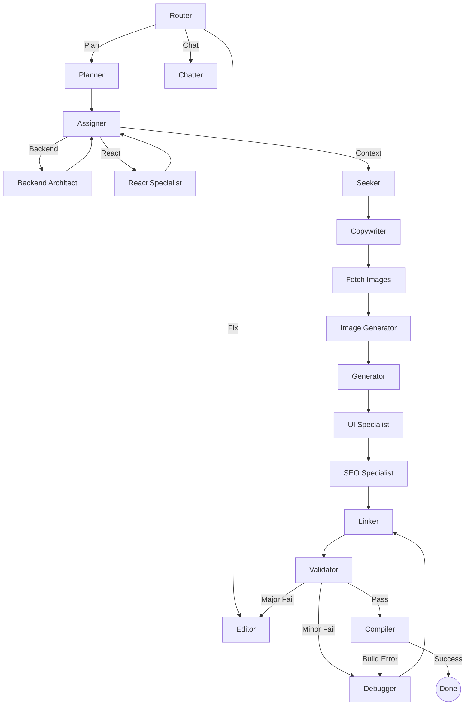

# Vibe LangGraph Logic & Orchestration

This document details the core engine of the Vibe platform, powered by **LangGraph**. The system uses a state-driven approach to orchestrate multiple specialized agents through a "Planning -> Execution -> Verification -> Recovery" lifecycle.

## 1. High-Level Workflow

The application lifecycle follows a sophisticated directed graph:

## 2. Core Agents

### Orchestrators
- **Router**: Directs incoming requests based on intent (new generation, modification, or simple chat).
- **Planner**: Decomposes user vibes into a multi-step execution plan including file structures and architectural logic.
- **Assigner**: Parallelizes specialized tasks between the Backend Architect and React Specialist.

### Creators
- **Generator**: The "Bulk Generator" that produces the initial base code for planned files using a robust 3-tier structure (Components, Hooks, Services).
- **UI Specialist**: Injects premium aesthetics (Framer Motion, Glassmorphism, tailored CSS) into the generated components.
- **SEO Specialist**: Optimizes the output for web standards and searchability.

### Quality Control (The Self-Healing Loop)
- **Linker**: Audits file relationships and applies surgical patches during modification runs.
- **Validator**: Performs structural integrity checks, syntax validation, and **Import Integrity Scans** (detecting missing files before they hit the build).
- **Debugger**: Surgically fixes specific errors flagged by the Validator or Compiler (e.g., missing imports, syntax errors).
- **Compiler**: Simulates a production environment (`npm install` -> `npm run build`) to ensure the code is actually runnable.

## 3. Advanced Features

### Import Integrity Protection
The system includes a custom recursive scanner that parses all `import` statements in the generated project state. If a file is referenced but hasn't been created yet, the **Validator** tags it as a `MISSING_FILE`, forcing the **Debugger** to generate the missing file instead of just fixing the import.

### Path Safety
The **Generator** uses a strictly enforced **Root Allowlist** to ensure configuration files (`.env`, `vite.config.js`, etc.) stay at the project root while source code is neatly organized into `src/`.

### Robust Parsing
All agent outputs are processed through a custom `parse_json_dict` utility that robustly extracts JSON even if the LLM includes excessive chatter or malformed escaping.

## 4. Running the Engine
The main entry point for the graph is `graph/workflow.py`, which is exposed via the FastAPI endpoints in `apps/api/routes/generate.py`.
