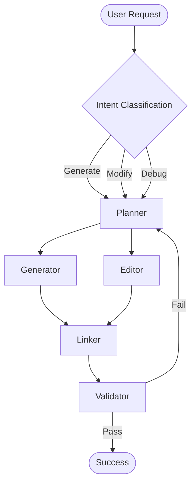

# HOW VIBE-LANGGRAPH WORKS

This document provides a **complete, end-to-end technical explanation** of how **Vibe-LangGraph** operates as an agentic coding platform. It is intended for engineers, contributors, and advanced users who want to understand the internal architecture, agent responsibilities, state management, and execution flow in detail.

---

## 1. High-Level Overview

Vibe-LangGraph is an **agent-orchestrated code generation and modification system** built on top of **LangGraph**. Instead of relying on a single monolithic LLM prompt, the system decomposes coding tasks into **specialized agents** that collaborate through a shared, structured state.

The platform is designed to:

* Generate **multi-file projects** reliably
* Modify existing codebases with **minimal diffs**
* Resolve errors through **self-correcting loops**
* Maintain a **virtual file system** independent of disk I/O
* Preserve conversational, human-friendly interaction

At its core, Vibe-LangGraph behaves more like a **compiler pipeline** than a chatbot.

---

## 2. Core Design Principles

Vibe-LangGraph is built on the following principles:

### 2.1 Separation of Concerns

Each agent has a **single, well-defined responsibility**. No agent plans, generates, edits, validates, and links code at the same time.

### 2.2 Deterministic State Transitions

All agents communicate exclusively through a shared state object (`CodebaseState`). Agents never rely on hidden context.

### 2.3 File-Scoped Generation

Code is generated and modified **per file**, not per project. This prevents hallucinated imports and accidental overwrites.

### 2.4 Compiler-Inspired Workflow

The system mirrors traditional software pipelines:

* Intent analysis (Planner)
* Code emission (Generator / Editor)
* Linking and resolution (Linker)
* Validation and diagnostics (Validator)

---

## 3. The Codebase State (`CodebaseState`)

The `CodebaseState` is the **single source of truth** passed between agents.

### 3.1 State Structure

```ts
CodebaseState = {
  userIntent: string,
  mode: "generate" | "modify" | "debug" | "explain",

  framework: {
    name: "react" | "next" | "node" | "custom",
    version?: string
  },

  plan: {
    steps: string[],
    filesToCreate: string[],
    filesToModify: string[]
  },

  files: {
    [path: string]: {
      content: string,
      language: string,
      imports: string[],
      exports: string[],
      artifactType: "code" | "config" | "doc",
      generatedBy: "generator" | "editor"
    }
  },

  dependencyGraph: {
    [file: string]: string[]
  },

  diagnostics: {
    errors: ValidationError[],
    warnings: ValidationWarning[]
  },

  conversation: {
    messages: string[],
    lastAgentResponse: string
  }
}
```

### 3.2 Why a Virtual File System?

* Prevents accidental overwrites
* Enables dry-runs and previews
* Allows rollback and diffing
* Makes agent orchestration deterministic

---

## 4. Agent Types and Responsibilities

Vibe-LangGraph uses **specialized agents**, each operating only on the data it needs.

---

## 5. Planner Agent (`agents/planner`)

### Purpose

The Planner is the **reasoning engine** of the system.

### Inputs

* User intent (natural language)
* Existing codebase (if any)
* Current diagnostics (for debug mode)

### Responsibilities

* Understand user intent
* Classify task type (generate / modify / debug)
* Break intent into executable steps
* Decide which files must be created or modified
* Define scope boundaries

### Outputs

* A structured implementation plan
* Explicit list of files to create/modify
* A short, engaging explanation for the user

### Example Output

```json
{
  "steps": [
    "Set up React project structure",
    "Create main App component",
    "Add routing logic"
  ],
  "filesToCreate": [
    "src/main.jsx",
    "src/App.jsx",
    "src/components/Navbar.jsx"
  ]
}
```

The Planner **never writes code**.

---

## 6. Generator Agent (`agents/generator`)

### Purpose

The Generator emits **new code files** based strictly on the Planner’s instructions.

### Inputs

* Implementation plan
* Explicit file list

### Responsibilities

* Generate code per file
* Respect framework conventions
* Avoid referencing files not listed in state

### Constraints

* Cannot invent new files
* Cannot modify existing files
* Cannot resolve imports

Each file is generated independently to avoid cross-file hallucination.

---

## 7. Editor Agent (`agents/editor`)

### Purpose

The Editor modifies **existing files** using **minimal diffs**.

### Inputs

* User modification/debug request
* Existing virtual file system
* Planner instructions

### Responsibilities

* Identify affected files
* Apply localized changes only
* Preserve formatting, comments, and logic

### Key Property

The Editor behaves like a **senior developer making a surgical patch**, not a rewriter.

---

## 8. Linker Agent (`agents/linker`)

### Purpose

The Linker acts as a **semantic linker and path resolver**.

### Inputs

* Generated/edited files

### Responsibilities

* Resolve relative and absolute imports
* Verify file existence
* Normalize paths
* Build dependency graph

### Example

```js
import Button from "./Button";
```

Becomes:

```text
src/components/Button.jsx
```

The Linker prevents broken builds and enables downstream validation.

---

## 9. Validator Agent (`agents/validator`)

### Purpose

The Validator ensures the codebase is **build-ready and standards-compliant**.

### Responsibilities

* Check syntax errors
* Validate framework conventions (React 18, Vite, etc.)
* Detect missing imports and unused exports
* Ensure minimal and correct `index.html`

### Output

```json
{
  "status": "fail",
  "errors": [
    {
      "type": "missing_import",
      "file": "src/App.jsx",
      "symbol": "Button",
      "severity": "blocking"
    }
  ]
}
```

### Recovery

Validation failures can trigger:

* Editor (for localized fixes)
* Planner (for structural issues)

---

## 10. Debugger Mode

Debugger mode is activated when the user intent implies failure:

* "Fix this error"
* "App not working"
* "Build fails"

### Flow

1. Planner analyzes diagnostics
2. Editor applies targeted fixes
3. Linker re-resolves dependencies
4. Validator re-checks

This enables **self-healing loops**.

---

## 11. Workflow Graph



---

## 12. Conversation Handling

While agents focus on code, the system also maintains:

* Human-readable explanations
* Change summaries
* Friendly confirmations

This ensures Vibe-LangGraph remains a **developer companion**, not just a compiler.

---

## 13. Extensibility

The architecture supports adding new agents:

* Test Generator Agent
* Documentation Agent
* Refactor Agent
* Security Audit Agent

Because all agents share the same state contract, extensions are low-risk.

---

## 14. Making the Architecture Strong & Scalable

This section describes **concrete architectural upgrades** that make Vibe-LangGraph production-grade, scalable, and resilient as usage, codebase size, and agent complexity grow.

---

## 14.1 Introduce a Dedicated Router Agent

### Why

Currently, intent routing is implicit. As the platform scales, ambiguous intents ("add auth and fix error") will increase.

### Solution

Add a **Router Agent** responsible only for:

* Intent classification (generate / modify / debug / explain)
* Confidence scoring
* Multi-intent splitting

```ts
RouterOutput = {
  primaryMode: "generate" | "modify" | "debug" | "explain",
  secondaryModes?: string[],
  confidence: number
}
```

This keeps the Planner focused on planning, not intent detection.

---

## 14.2 Stratify the Global State (State Layering)

### Problem

A single flat `CodebaseState` grows complex and fragile at scale.

### Solution

Logically separate state into layers:

```ts
State = {
  intentState,
  planState,
  codeState,
  diagnosticsState,
  conversationState,
  executionState
}
```

### Benefits

* Prevents context pollution
* Enables partial re-runs
* Improves debugging and observability

---

## 14.3 Make Validation Compiler-Grade

### Upgrade Validator → Diagnostic Engine

Instead of boolean pass/fail, return **structured diagnostics**:

```ts
ValidationError = {
  id: string,
  type: "syntax" | "import" | "config" | "framework",
  file: string,
  message: string,
  severity: "warning" | "blocking",
  autoFixable: boolean
}
```

### Result

* Editor auto-fixes `autoFixable=true` errors
* Planner handles architectural issues

This enables **true self-healing loops**.

---

## 14.4 Add Agent Contracts (Hard Boundaries)

Each agent should expose:

* Accepted inputs
* Guaranteed outputs
* Forbidden actions

Example (Generator):

```md
- MUST only generate listed files
- MUST NOT reference unknown paths
- MUST emit one file per execution
```

This prevents agent drift as the system grows.

---

## 14.5 Versioned Plans & Rollback Support

### Why

Large edits need safe recovery.

### Solution

Store versions:

```ts
planVersion: number
fileVersions: { [path: string]: number }
```

Enable:

* Rollback to last stable state
* Diff-based review

---

## 14.6 Parallelize Safely (Scalability Win)

### What Can Be Parallel

* Generator per file
* Validator per file
* Linker graph construction

### Constraint

All parallel agents must write to **isolated state slices**.

This allows horizontal scaling without race conditions.

---

## 14.7 Observability & Telemetry

Add structured logs:

```ts
AgentEvent = {
  agent: string,
  action: string,
  durationMs: number,
  stateDelta: string[]
}
```

Benefits:

* Performance tuning
* Debugging agent failures
* Usage analytics

---

## 14.8 Introduce Non-Code Artifact Awareness

Differentiate artifacts explicitly:

```ts
artifactType: "code" | "config" | "doc" | "test"
```

This prevents incorrect assumptions during generation and validation.

---

## 14.9 Sandbox & Safety Limits

To remain stable at scale:

* Max files per run
* Max tokens per agent
* Max retry loops

Fail gracefully instead of cascading errors.

---

## 14.10 Extensible Agent Registry

Use a registry-based design:

```ts
AgentRegistry = {
  planner,
  generator,
  editor,
  linker,
  validator,
  testGenerator,
  securityAudit
}
```

This allows plug-and-play agents without changing the core graph.

---

## 15. Final Architectural Guarantees

With these upgrades, Vibe-LangGraph guarantees:

* Deterministic multi-file generation
* Safe large-scale modifications
* Self-healing error resolution
* Horizontal scalability
* Clear agent accountability

Vibe-LangGraph evolves from an LLM tool into a **true agentic compiler platform**