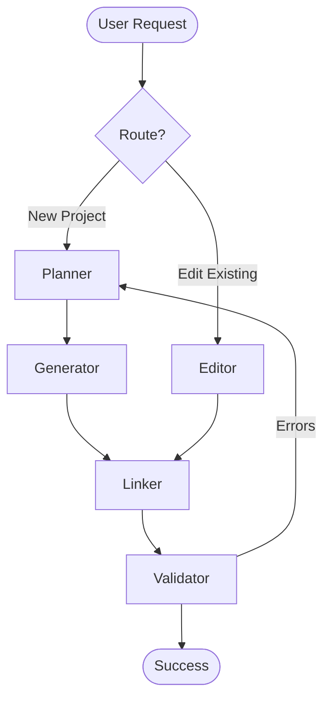

# How Vibe-LangGraph Works

Vibe-LangGraph is an agentic coding platform designed to autonomously generate, link, edit, and validate code based on user intent. It uses a graph-based architecture (LangGraph) to orchestrate specialized agents.

## Core Architecture

The system is built on a **State Graph** (`CodebaseState`) that passes context between agents.

### The Agents

1.  **Planner Agent** (`agents/planner`)
    *   **Input**: User Intent (e.g., "Create a snake game")
    *   **Role**: Breaks the intent down into a technical implementation plan.
    *   **Output**: A list of files to generate/modify and a step-by-step guide.

2.  **Generator Agent** (`agents/generator`)
    *   **Input**: Implementation Plan + File List
    *   **Role**: Generates the actual code for each file independently.
    *   **Constraint**: Can ONLY reference files explicitly listed in the state to prevent hallucinations.

3.  **Linker Agent** (`agents/linker`)
    *   **Input**: Generated Files
    *   **Role**: "Link Editor". Checks for missing imports, circular dependencies, and ensures framework conventions (e.g., Next.js folder structure) are followed.
    *   **Action**: Fixes import paths and wiring.

4.  **Editor Agent** (`agents/editor`)
    *   **Input**: User Edit Request (e.g., "Add dark mode") + Existing Codebase
    *   **Role**: Identifies affected files and applies minimal diffs to preserve formatting and logic.

5.  **Validator Agent** (`agents/validator`)
    *   **Input**: Final Codebase
    *   **Role**: Runs static, build sanity, and dead code checks.
    *   **Output**: Final approved code or a loop back to Editor/Generator for fixes.

## The Workflow (The Graph)

The orchestration is defined in `graph/workflow.py`:

*(Note: The feedback loop from Validator to Planner/Editor is a planned enhancement)*

## State Management

The `CodebaseState` tracks:
- `files`: Content, language, imports/exports.
- `dependencyGraph`: Relationship between files.
- `userIntent`: The original request.
- `framework`: The chosen tech stack (Next.js, React, etc.).

## Usage Flow

1.  **User** sends a request via the API (`/api/v1/generate`).
2.  **API** initializes the state and triggers the LangGraph workflow.
3.  **Agents** execute sequentially (or effectively via the graph).
4.  **System** returns the fully generated/modified project state.
